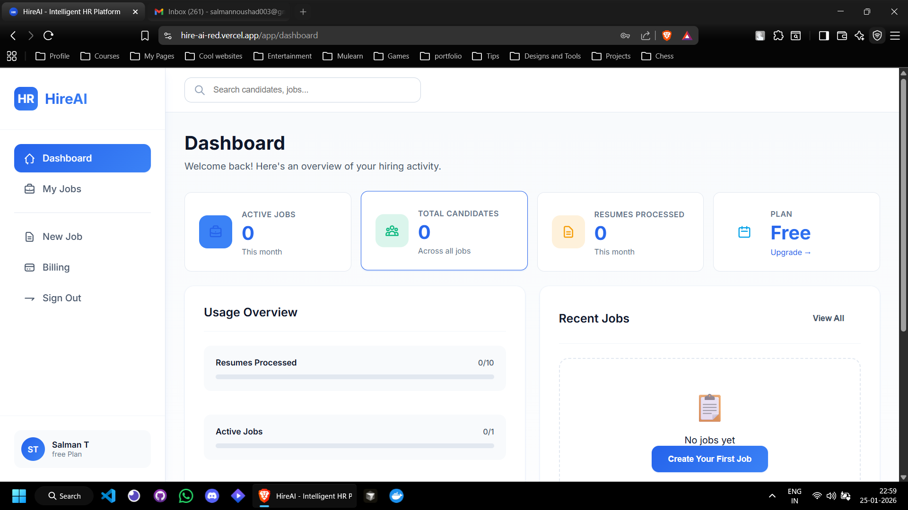
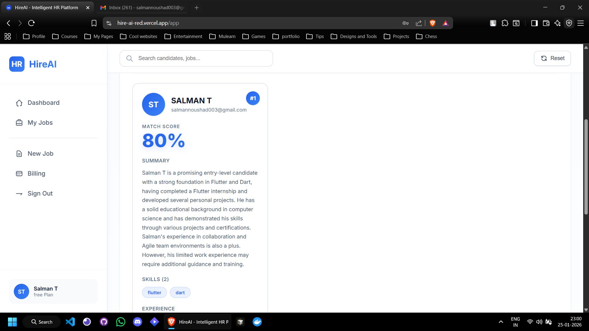
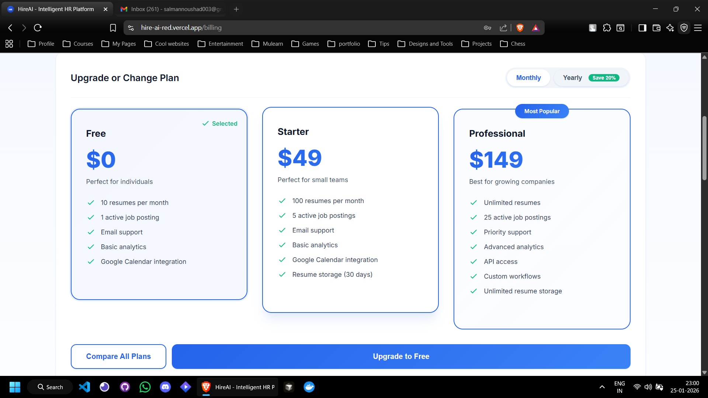

# 🤖 Hire AI Agent






[▶ Watch Demo Video](https://your-video-link-here)

---

An AI-powered recruitment assistant that automatically analyzes resumes, ranks candidates, schedules interviews, and sends communications — helping recruiters hire faster, smarter, and with less manual effort.

> Built with a modern full-stack architecture using React, FastAPI, PostgreSQL (Neon), and Groq for ultra-fast AI inference.

---

## 🚀 Features

### 🤖 AI-Powered Resume Analysis (Powered by Groq)
- Uses Groq LLMs to analyze resumes and extract skills, experience, and role fit
- Matches candidates to job descriptions with high accuracy
- Eliminates manual resume screening

### 📊 Smart Candidate Ranking
- Automatically ranks candidates based on:
  - Skill match
  - Years of experience
  - Role relevance
  - Resume quality
- Recruiters see top candidates instantly

### 📅 Auto Interview Scheduling
- Integrates with Google Calendar
- Automatically suggests and books interview slots
- Avoids conflicts and double-bookings

### 📧 Email Automation
- Sends personalized emails for:
  - Interview confirmations
  - Reminders
  - Status updates
- Reduces recruiter follow-ups

### ⚡ Lightning Fast Processing
- Powered by Groq for low-latency inference
- Processes hundreds of resumes in minutes instead of hours or days

---

## 🧠 Tech Stack

### Frontend
- React (Create React App)
- Custom CSS
- Axios
- React Router

### Backend
- FastAPI
- SQLAlchemy ORM
- Alembic Migrations

### Database
- PostgreSQL (Neon)

### AI
- Groq API (LLM inference)
- Resume parsing and scoring logic

### Integrations
- Google Calendar API
- SMTP Email (Gmail / SendGrid)

### Infrastructure
- Frontend: Vercel
- Backend: Render
- Database: Neon

---

## 🗂️ Project Structure

```text
hire-ai/
├── frontend/          # React frontend
├── backend/           # FastAPI backend
│   ├── app/
│   │   ├── routers/
│   │   ├── models/
│   │   ├── services/
│   │   └── schemas/
│   └── main.py
└── README.md
